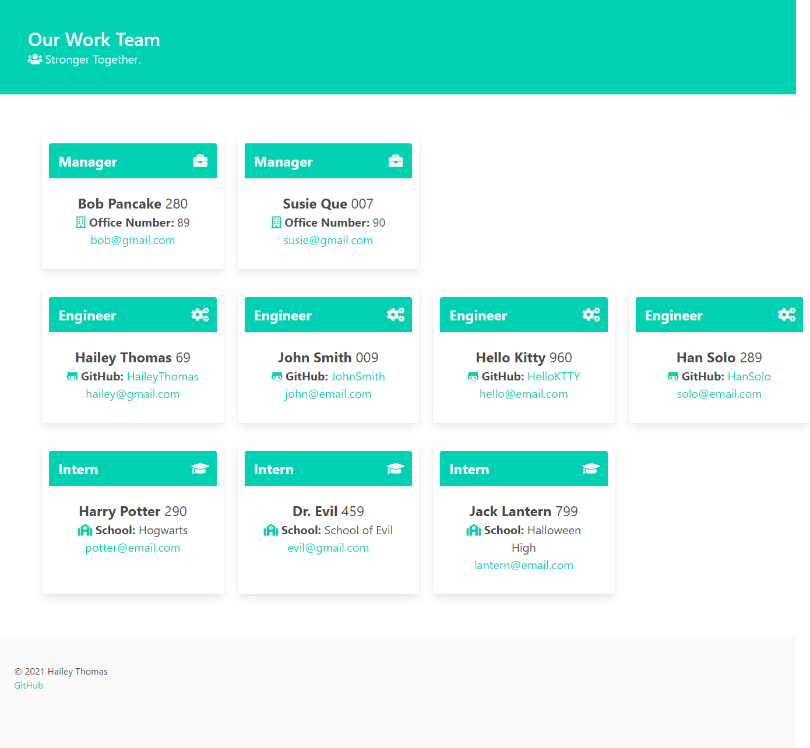

# Team Portfolio Generator 💼

## Description

- This Work Team Portfolio Generator is a tool so that anyone could create a nice looking team portfolio without any coding knowledge- it does the work for you!
- Now we can have a website with all of our employees in one place. Just answer a few questions and open the new index.html file in your browser!
- Some problems I ran into while creating this project were the new concepts we learned of deconstructing and filtering arrays. It was definitely a challenge but at the end of the project I feel much more confident in these skills. There are so many array methods its overwhelming at first but then really exciting!

## Table of Contents

* [Installation](#installation)
* [Usage](#usage)
* [Credits](#credits)
* [License](#license)

## Installation

Download files and run application in your terminal with Node.js

## Usage

Run project in Node.js by entering node index in the terminal. Answer all the questions for employees then look in your /dist folder to find your new Work Team Portfolio!

### Screenshot

### Links

* [Video](https://drive.google.com/file/d/1cimk3QAWggjj07-0NqhRS9ENSxcSn6Di/view?usp=sharing) - link to watch video demonstration
* [GitHub](https://github.com/HaileyThomas/team-portfolio-generator) - link to GitHub project

## Credits

USed Bulma framework for CSS, Inquirer for the questions and Jest for testing.

## License

[License](https://opensource.org/licenses/MIT) - link to license

MIT License

Copyright (c) [2021] [Hailey Thomas]

Permission is hereby granted, free of charge, to any person obtaining a copy
of this software and associated documentation files (the "Software"), to deal
in the Software without restriction, including without limitation the rights
to use, copy, modify, merge, publish, distribute, sublicense, and/or sell
copies of the Software, and to permit persons to whom the Software is
furnished to do so, subject to the following conditions:

The above copyright notice and this permission notice shall be included in all
copies or substantial portions of the Software.

THE SOFTWARE IS PROVIDED "AS IS", WITHOUT WARRANTY OF ANY KIND, EXPRESS OR
IMPLIED, INCLUDING BUT NOT LIMITED TO THE WARRANTIES OF MERCHANTABILITY,
FITNESS FOR A PARTICULAR PURPOSE AND NONINFRINGEMENT. IN NO EVENT SHALL THE
AUTHORS OR COPYRIGHT HOLDERS BE LIABLE FOR ANY CLAIM, DAMAGES OR OTHER
LIABILITY, WHETHER IN AN ACTION OF CONTRACT, TORT OR OTHERWISE, ARISING FROM,
OUT OF OR IN CONNECTION WITH THE SOFTWARE OR THE USE OR OTHER DEALINGS IN THE
SOFTWARE.

## Tests

Tests created with jest. 10 tests for all employee objects.

## Questions

Feel free to use my code and to contact me with any questions.

### Contact

* [Email](mailto:haileyraebeauty@gmal.com) - Email Hailey Thomas : haileyraebeauty@gmal.com
* [GitHub](https://github.com/HaileyThomas) - GitHub username : HaileyThomas